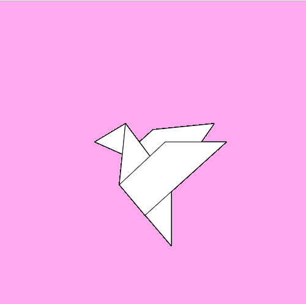

# miniex1 
I want to make an geometrical origami bird that can flap its wings 

Setup 

	- Create canvas 500*500
	- Background #fae from background references 
Draw

I played around with the numbers of the x and y coordniates to get the right shapes and position of the shapes. 
	- Triangle - positioned to mach the beak 
	- Quad - body 
	- Back wing - as I put the different shapes together the previous coordinates of the other shapes helped guide me 
	
I succeeded in making the bird.(See screenshot).  

 "Bird"

Animation 

I want to animate the wings of the bird, but I am not sure how to do this. I'm thinking of two different ways; 
	- Hit the space bar to flap the wings 
	- Clap your hands to flap wings 
	
I prefer to make it so that the wings flap when you clap your hands= via sound. I want to make it interactive and closer to you than simply pressing a button

As i started to investigate how this could be made possible I got frustrated. I couldnt find a suitable syntax and i tried some of them which led to frustrations. I tried redraw and loop because they seemed to be most suitable. I looked at the reference and tried to apply the syntax to my code. What happened was either parts of the bird dissapearing or everything dissapearing entirely. After an hour of trying different transformations, I realixed that I needed more experience in order to animate. However, I do not see this as a failure. I've come to have a better understanding of programming and I truly believe that I cold become quite good at it. After a lot of practice of course.  
